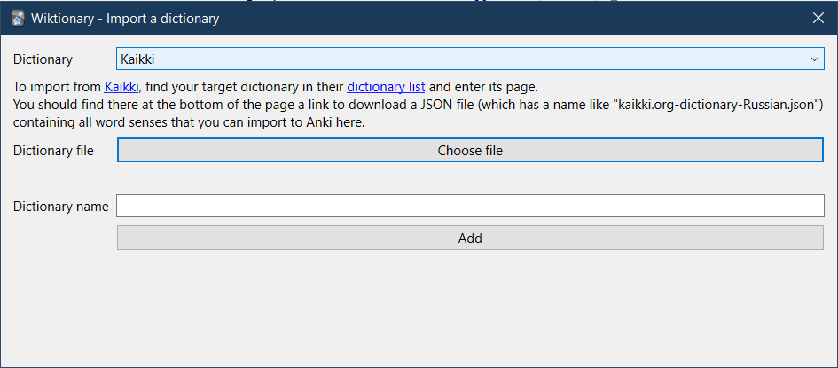

Anki add-on to query words using Wiktionary data downloaded from https://kaikki.org

## Usage

The add-on provides an interface to fill notes with defintions, example sentences, etc.
The interface can either be accessed from a button in the editor, or via the _Edit > Bulk-define from Wiktionary_ menu
item in the browser for bulk operations on selected notes. You can also configure shortcuts from _Tools > Add-ons_.

You have to download the dictionary data you want for the add-on to work.
For that, find your target language in https://kaikki.org/dictionary/ and download the JSON file containing all data listed at the bottom of the language page (which has a name like "kaikki.org-dictionary-Russian.json").
Then in Anki, go to _Tools > Wiktionary -> Import a dictionary_ to import the dictionary.

## Download

You can download the add-on from its AnkiWeb page: https://ankiweb.net/shared/info/2087444887

## Changelog

See [CHANGELOG.md](./CHANGELOG.md) for a list of changes.

## Credit

The icons are taken from https://en.wiktionary.org/

## Support & feature requests

Please post any questions, bug reports, or feature requests in the [support page](https://forums.ankiweb.net/t/wiktionary-add-on/19571) or the [issue tracker](https://github.com/abdnh/anki-wiktionary/issues).

If you want priority support for your feature/help request, I'm available for hire.
Get in touch via [email](mailto:abdo@abdnh.net) or the UpWork link below.

## Support me

Consider supporting me if you like my work:

I'm also available for freelance add-on development:

